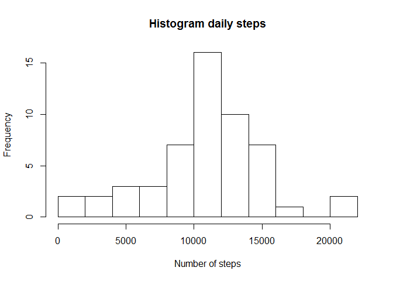
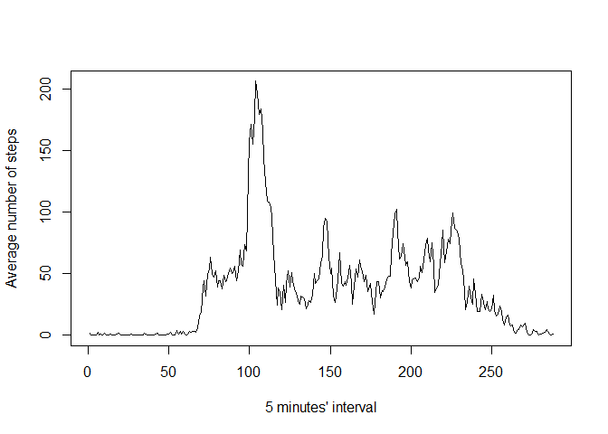
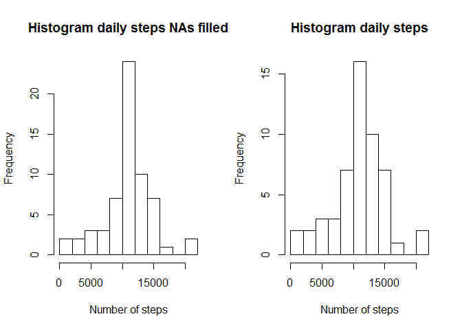
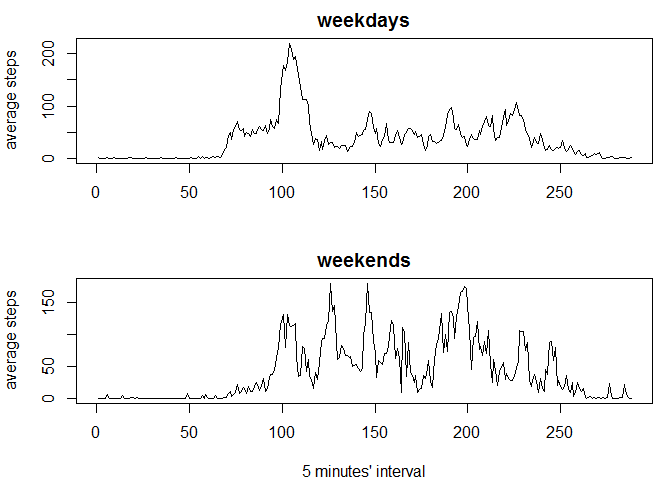

# Reproducible Research: Peer Assessment 1


## Loading and preprocessing the data

1. Set the working directory to the github subdirectory where the data is loaded
2. Unzip and read file csv
3. Eliminate NAs in activity data.frame. This last data.frame will not be used, as sugested, but is something I would normally do


```r
setwd("C:/Users/Victoria/Documents/GitHub/RepData_PeerAssessment1/RepData_PeerAssessment1")
unzip("activity.zip")
activity<-read.csv("activity.csv")
activity_clean<-activity[complete.cases(activity),]
```


## What is mean total number of steps taken per day?


### Load library "dplyr" to use summarize. It has to be installed previously

```r
## install.packages("dplyr")
library("dplyr")
```

### Make a histogram of the total number of steps taken each day


```r
activity_daily <- summarise(group_by(activity,date),steps=sum(steps))
par(mfrow=c(1,1))
hist(activity_daily$steps,breaks=8,main="Histogram daily steps",xlab="Number of steps")
```

\


### Calculate and report the mean and median total number of steps taken per day


```r
       ## Display the average number of steps per day
        activity_daily_mean <- mean(activity_daily$steps,na.rm = TRUE)
        activity_daily_mean
```

```
## [1] 10766.19
```

```r
        ## Display the median number of steps per day
        activity_daily_median <- median(activity_daily$steps,na.rm = TRUE)
        activity_daily_median
```

```
## [1] 10765
```


## What is the average daily activity pattern?

### Make a time series plot (i.e. type = "l") of the 5-minute interval (x-axis) and the average number of steps taken, averaged across all days (y-axis)


```r
activity_mean<- summarise(group_by(activity,interval),
                         steps=mean(steps,na.rm = TRUE))
## convert interval format to number of 5 minutes'interval to get a 
## correct representation of average steps per interval, with 
## function time() and plot result

        plot(time(activity_mean$interval),
             activity_mean$steps, 
             type="l", 
             xlab="5 minutes' interval", 
             ylab="Average number of steps" )
```

\


### Which 5-minute interval, on average across all the days in the dataset, contains the maximum number of steps?


```r
activity_mean$interval[which.max(activity_mean$steps)]
```

```
## [1] 835
```


## Imputing missing values

### Calculate and report the total number of missing values in the dataset (i.e. the total number of rows with NAs)


```r
        sum(is.na(activity))
```

```
## [1] 2304
```


### Devise a strategy for filling in all of the missing values in the  dataset. The strategy does not need to be sophisticated. For example, you could use the mean/median for that day, or the mean for that 5-minute interval, etc.

### I will use the mean for that 5-minute interval


### Create a new dataset that is equal to the original dataset but with the missing data filled in.


```r
activity_filled<-activity
        
for (i in 1:length(activity$steps)) {
        if (is.na(activity$steps[i])){
        interval<-activity$interval[i]
        activity_filled$steps[i]<-activity_mean$steps[which(interval==activity_mean$interval)]
        }  
} 
        
## Check new file has no NAs 
sum(is.na(activity_filled))
```

```
## [1] 0
```

### Make a histogram of the total number of steps taken each day and Calculate and report the mean and median total number of steps taken per day. 


```r
## Make a histogram of the total number of steps taken each day and compare it with the one obtained before without filling in the missing values 
        
activity_filled_daily <- summarise(group_by(activity_filled,date),steps=sum(steps))

par(mfrow=c(1,2)) 
       
hist(activity_filled_daily$steps,
             breaks=8,
             main="Histogram daily steps NAs filled",
             xlab="Number of steps")
        
hist(activity_daily$steps,
             breaks=8,
             main="Histogram daily steps",
             xlab="Number of steps")
```

\

```r
## Calculate and report the mean and median total number of steps taken per day
        
## Display the average number of steps per day
        
        activity_filled_daily_mean <- mean(activity_filled_daily$steps)
        activity_filled_daily_mean
```

```
## [1] 10766.19
```

```r
        ## Display the median number of steps per day
        activity_filled_daily_median <- median(activity_filled_daily$steps)
        activity_filled_daily_median
```

```
## [1] 10766.19
```

### Do these values differ from the estimates from the first part of the assignment? What is the impact of imputing missing data on the estimates of the total daily number of steps?

The mean is the same but the median now is different and equal to the mean after having filled the missing values with the mean value in each 5 minutes interval. As you can see the histograms are similar in shape but in the one filled in there are much more values in the interval with maximum frequency as expected.


## Are there differences in activity patterns between weekdays and weekends?

### Create a new factor variable in the dataset with two levels -- "weekday" and "weekend" indicating whether a given date is a weekday or weekend day


```r
        library("lubridate")
        activity_filled$date<-as.Date(activity_filled$date, "%Y-%m-%d")
        activity_filled$week<-weekdays(activity_filled$date)
        weekday <- c("lunes","martes","miercoles","jueves","viernes")
        weekend <- c("sabado","domingo")
        for (i in 1:length(activity_filled$week)) { 
                if (activity_filled$week[i] %in% weekend ) {activity_filled$week[i]<-"weekend"}
                else {activity_filled$week[i]<- "weekday"}
        }
```


### Make a panel plot containing a time series plot (i.e. type = "l") of the 5-minute interval (x-axis) and the average number of steps taken, averaged across all weekday days or weekend days (y-axis).


```r
activity_filled_mean_week<- summarise(group_by(activity_filled,interval,week),
                                  steps=mean(steps,na.rm = TRUE))
        
## convert interval format to number of 5 minutes'interval to get a 
## correct representation of average steps per interval, with 
## function time() and plot result
        
        par(mfrow=c(2,1),mar = c(4, 4, 2, 1))
        with (subset(activity_filled_mean_week,week=="weekday"),
             plot (time(interval),
             steps,
             type="l",
             xlab="",
             ylab="average steps",
             main="weekdays")
             )
             
        with (subset(activity_filled_mean_week,week=="weekend"),
                plot(time(interval),
                steps,
                type="l",
                xlab="5 minutes' interval",
                ylab="average steps",
                main="weekends")
              )
```

\


As you can see in the panel plot, in weekdays there is only one peak interval with maximum number of steps around  8:35-8:40, as expected due to people going to work. In the weekends there are several peaks of steps and more steps than during weekdays. 

